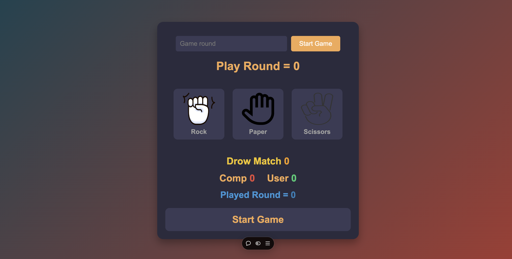
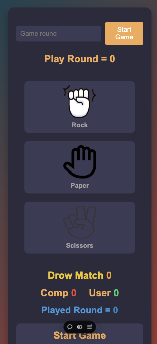

# Rock-Paper-Scissors Game 🎮

A simple, interactive **Rock-Paper-Scissors** game built with HTML, CSS, and JavaScript. Test your luck and strategy by competing against the computer in this timeless classic.

## 🎨 Features
- Responsive design for all devices 📱💻.
- User-friendly interface with engaging color themes.
- Real-time score tracking for:
  - User Wins ✅
  - Computer Wins ❌
  - Draw Matches 🤝
- Adjustable game rounds for a custom experience.
- Dynamic gameplay messages to keep the excitement alive.

## 🚀 How to Play
1. Enter the number of rounds you want to play.
2. Click on **Rock**, **Paper**, or **Scissors** to make your move.
3. The computer will randomly select its move.
4. Scores will update automatically based on the outcome of each round:
   - **Rock beats Scissors**
   - **Paper beats Rock**
   - **Scissors beats Paper**
5. Enjoy the game and may the odds be in your favor!

## 💻 Technologies Used
- **HTML5** for the structure.
- **CSS3** for styling and responsiveness.
- **JavaScript** for game logic and interactivity.

## 📷 Screenshots

## 📂 Folder Structure
